```{r setup, include=FALSE}
options(htmltools.dir.version = FALSE)
library(xaringanthemer)
library(dplyr)
library(tidyr)
library(ggplot2)
style_mono_accent(base_color = "#e06666")
theme_set(theme_minimal())
```

# Översikt

**1.** Kvantitativa forskningsprocessen

**2.** Datanivåer och variabeltyper

**3.** Univariat beskrivande statistik

**4.** Grafisk resultatpresentation

---

class: inverse, center, middle

# Kvantitativa forskningsprocessen

---

# Kvantitativa forskningsprocessen

.pull-left[ __Kvantitativa metod__ är ett samlingsbegrepp metoder för __insamling__ av siffermässig __data__ eller kvantifiering av data till siffror.  __Statistiska beräkningar__ används som __bearbetningsmetoder.__]

.pull-right[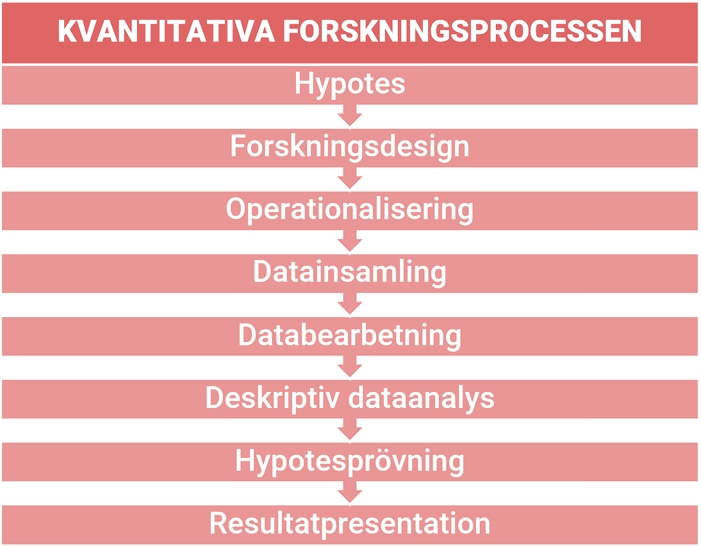]

---

# Operationalisering

Att __göra ett begrepp__ som vi ämnar att studera __mätbart__ för att på så sätt kunna lagra informationen i form av __variabler__. Grunden till empirisk forskning. Att göra ett begrepp mätbara kräver att vi först __tydligt definier begreppet__.

Vad betyder brottslighet och hur mäter vi brottslighet?

Vad betyder självkontroll och hur mäter vi självkontroll?

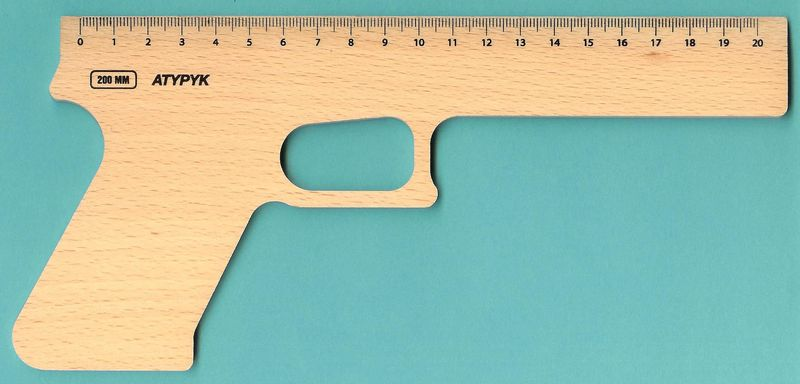

---

# Operationalisering
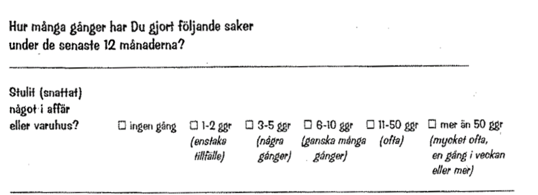

---

# Operationalisering
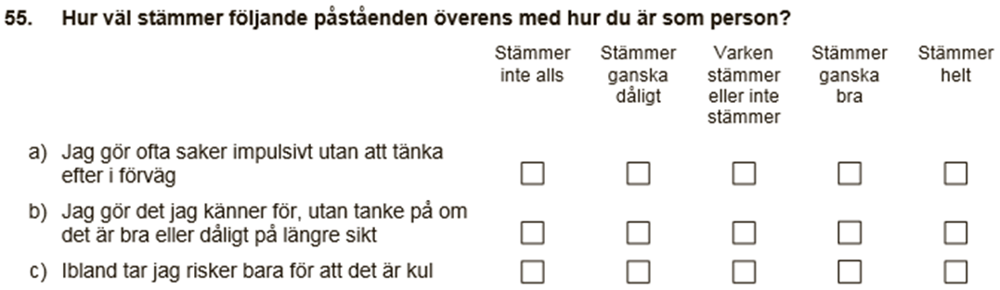

---

# Variabel

.pull-left[Defineras som ett värde som kan __variera från observation till observation__. 

__Analysenhet__ är den eller __de enheter som du analyserar__ i din studie]

.pull-right[
```{r, echo=FALSE}
df <- tibble("Person ID" = 1:6,
             "Ålder" = rbinom(6, 30, .85))

DT::datatable(df, fillContainer = FALSE, rownames = FALSE, options = list(pageLength = 11, dom = 't'))
```
]

---

# Variabel

.pull-left[Defineras som ett fenomen vars värde kan __variera från observation till observation__. Motsatsen till en variabel är en konstant.

__Analysenhet__ är den eller __de enheter som du analyserar__ i din studie]

.pull-right[
```{r, echo=FALSE}
df <- tibble("Land" = c("Sverige", "Danmark", "Norge", "Finland", "Island"),
             "Intagna (per 100 000)" = c(235, 249, 208, 138, 164))

DT::datatable(df, fillContainer = FALSE, rownames = FALSE, options = list(pageLength = 11, dom = 't'))
```
]

---

# Variabel

.pull-left[Defineras som ett värde som kan __variera från observation till observation__. 

__Analysenhet__ är den eller __de enheter som du analyserar__ i din studie]

.pull-right[
```{r, echo=FALSE}
df <- tibble("År" = 2013:2017,
             "Återfall (%)" = c(40, 40, 39, 39, 39))

DT::datatable(df, fillContainer = FALSE, rownames = FALSE, options = list(pageLength = 11, dom = 't'))
```
]

---

# Dataset

- En __samling data (eller variabler) som behandlas tillsammans__ för ett bestämt ändamål i ett __datorprogram__.

--

- __Data__ som __numerisk information__ (även om informationen uttrycks i bokstäver).

---

# Dataset

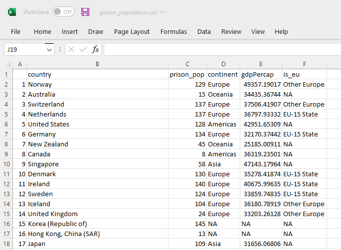

---

# Dataset

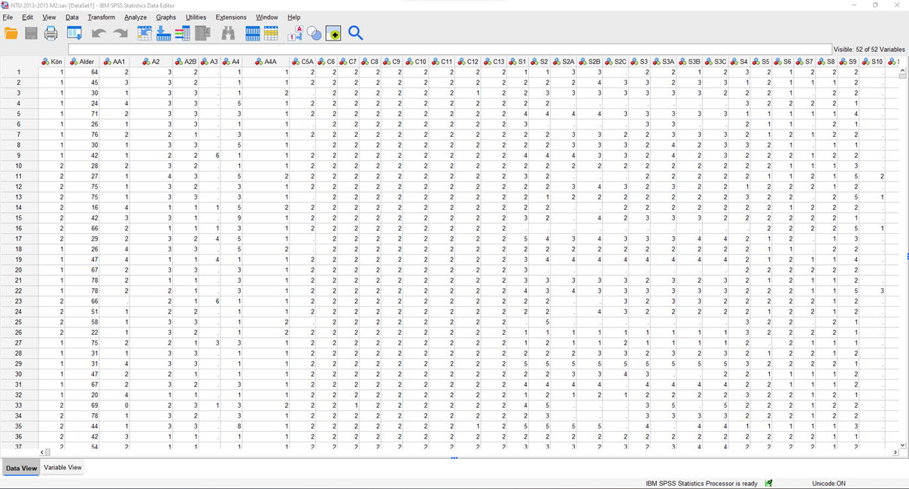

---

class: center, middle


---

class: inverse, center, middle

# Variabeltyper och datanivåer

---

# Datanivå

.pull-right[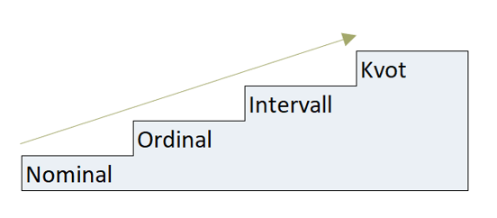]

- Variablernas __matematiska karaktär__.


- På __lägre nivåer__ har siffrorna betydelser som är egentiligen bara __etiketter.__


- På __högsta mätnivåer__ har siffrorna __numeriska betydelser__ och kan anlyseras på en mängd olika sätt.


- Det är __viktigt att veta vilken typ av variabel som du använder__, så att du kan välja rätt statistiska test, centralmått, spridningsmått och grafisk presentation.

---

# Fiktivt dataset

```{r, echo=FALSE}
df <- tibble(
  "Person ID" = 1:11,
  "Brottstyp" = c("Inbrott", "Misshandel", "Misshandel", "Snatteri", "Snatteri", "Annat", "Annat", "Misshandel", "Snatteri", "Annat", "Annat"),
  "Ålder" = rbinom(11, 35, .85),
  "Kön" = c("Man", "Kvinna", "Man", "Man", "Man", "Kvinna", "Kvinna", "Man", "Man", "Man", "Kvinna"),
  "Civiltillstånd" = c("Gift", "Ogift", "Ogift", "Ogift", "Gift", "Gift", "Gift",  "Ogift", "Ogift", "Ogift", "Gift"),
  "SES" = c("Medelklass", "Arbetarklass", "Underklass", "Arbetarklass",  "Arbetarklass", "Överklass", "Medelklass",  "Arbetarklass", "Medelklass", "Underklass", "Arbetarklass")
)

DT::datatable(df, fillContainer = FALSE, rownames = FALSE, options = list(pageLength = 11, dom = 't'))
```

---

# Nominal
.pull-left[__Icke-numeriska kategorier__ som representerar något annat än siffror.

Kategorierna __kan ej rangordnas__.]

.pull-right[
```{r, echo=FALSE}

DT::datatable(df %>% 
                select("Person ID", "Kön"), 
              fillContainer = FALSE, rownames = FALSE, options = list(pageLength = 11, dom = 't'))
```
]

---

# Nominal
.pull-left[__Icke-numeriska kategorier__ som representerar något annat än siffror.

Kategorierna __kan ej rangordnas__.

Kan tilldelas ett numeriskt värde för statistiska ändamål.

Det förekommer tillfällen då dessa värden är sorterade. Detta betyder dock ej att siffrorna kan användas för matematiska beräkningar.]

.pull-right[
```{r, echo=FALSE}

DT::datatable(df %>% 
                mutate(Man = ifelse(Kön == "Man", 1, 0)) %>% 
                select("Person ID", Man), fillContainer = FALSE, rownames = FALSE, options = list(pageLength = 11, dom = 't'))
```
]

---

# Nominalvariabler i datasetet

```{r, echo=FALSE}

DT::datatable(df, fillContainer = FALSE, rownames = FALSE, options = list(pageLength = 11, dom = 't'))
```

---

# Ordinal 

.pull-left[__Kategorier kan rangordnas__ från hög till låg, mer eller mindre

Värdet har bara  betydelse i förhållande till andra värden

Kan inte summera eller subtrahera dessa värden]

.pull-right[]

---

# Ordinal 

.pull-left[__Kategorier kan rangordnas__ från hög till låg, mer eller mindre

Värdet har bara  betydelse i förhållande till andra värden

Kan inte summera eller subtrahera dessa värden]

.pull-right[
```{r, echo=FALSE}

DT::datatable(df %>% 
                select("Person ID", SES), fillContainer = FALSE, rownames = FALSE, options = list(pageLength = 11, dom = 't'))
```
]

---

# Intervall

.pull-left[__Ekvidistans__ - lika avstånd mellan värdena.

Med dessa variabler kan man utföra alla tänkbara matematiska beräkningar.]


.pull-right[]

---

# Kvot

.pull-left[__Ekvidistans__ - lika avstånd mellan värdena.

Med dessa variabler kan man utföra alla tänkbara matematiska beräkningar.

Har en __absolut/meningsfull nollpunkt__.
]

.pull-right[
```{r, echo=FALSE}

DT::datatable(df %>% 
                select("Person ID", "Ålder"), fillContainer = FALSE, rownames = FALSE, options = list(pageLength = 11, dom = 't'))
```
]

---

# Två olika typer av intervall/kvot-variabler

__Diskret variabel__ - grundläggande måttenhet som __inte kan delas__.

--

- Antal brottmålsdomar

- Befolkning

- Antal syskon

- Antal skilsmässor

--

__Kontinuerlig variabel__ - kan i teorin vara __oändligt delbar__.

--

- Ålder

- Tid i fängelse

---

# Datanivåer

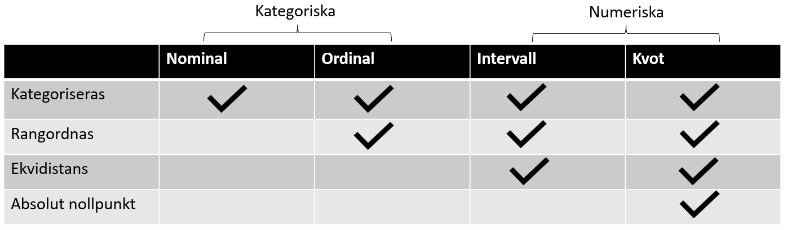
---
class: inverse, center, middle

# Antal anmälda brott under en månad på SU. 

# Vilken datanivå?

---

class: inverse, center, middle

# Beskrivande statistik

---

# Beskrivande statistik

Två typer av statistik:

.pull-left[
- Beskrivande statistik är en gren inom statistiken som går ut på att __beskriva och sammanfatta en samling data__ eller variabler. Data kan till exempel beskrivas med hjälp av __centralmått__ och __spridningsmått.__ 

- Den beskrivande statistiken skiljer sig från __inferentiell statistik__, som går ut på att __dra generella slutsatser om en population med hjälp av stickprov__.
]

.pull-right[

]

---

# Beskrivande statistik

__Univariat__ - sammanfattar eller beskriver fördelningen av en variabel 

--

__Bivariat__ - beskriver förhållandet mellan två variabler 

--

__Multivariat__ - beskriver förhållandet mellan tre eller flera variabler

---

# Univariat beskrivande statistik

.pull-left[__Sammanfatta__ information om __enstaka variabler__. 

Presentera resultat på ett __lättförståeligt__ sätt.

Information såsom dess __mittpunkt__ (centralmått) och dess __spridning__ (spridningsmått).]

.pull-right[
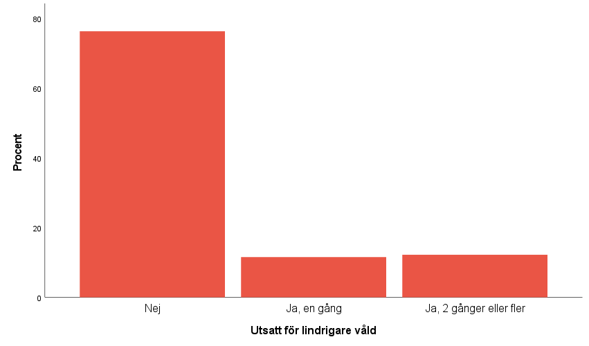
]

---

# Absolut frekvens

__Antal förekomster__ av  __enskilda variabelvärden__.

.pull-left[
```{r, echo=FALSE}
data.frame(df %>% count(Brottstyp))
```
]

.pull-right[
```{r, echo=FALSE}

DT::datatable(df %>% 
                select("Person ID", "Brottstyp"), fillContainer = FALSE, rownames = FALSE, options = list(pageLength = 11, dom = 't'))
```
]

---

# Absolut frekvens

__Problematiska__ vid __numeriska variabler__.

---

# Absolut frekvens

.pull-left[
```{r, echo=FALSE}

df_2 <- tibble(
  "Person ID" = 1:1000,
  "Ålder" = rbinom(1000, 70, .4),
)

DT::datatable(df_2 %>% 
                select("Person ID", "Ålder"), fillContainer = FALSE, rownames = FALSE, options = list(pageLength = 11, dom = 't'))
```
]

.pull-right[
```{r, echo=FALSE}
data.frame(df_2 %>% count(Ålder))
```
]

---

# Absolut frekvens

Intervall- och kvotvariablervariabler kan __kodas om till ordinala variabler__. 

Vi __offrar vissa detaljer__ för att få en tydligare tabell.

Exempelvis till åldersspann: 

- Åldersspann 0-15 år gammal

- Åldersspann 16-25 år gammal

- Åldersspann 26-40 år gammal

- Åldersspann >40 år gammal

---

# Absolut frekvens
.pull-left[
```{r, echo=FALSE}

df_2  <- df_2 %>% 
  mutate(Ålder_kategorier = case_when(Ålder > 0 & Ålder <= 15 ~ "0-15",
                                      Ålder > 15 & Ålder <= 25 ~ "16-25",
                                      Ålder > 25 & Ålder <= 40 ~ "26-40",
                                      Ålder > 40 ~ ">40"))

DT::datatable(df_2 %>% 
                select("Person ID", "Ålder_kategorier"), fillContainer = FALSE, rownames = FALSE, options = list(pageLength = 10, dom = 't'))
```
]

.pull-right[
```{r, echo=FALSE}
data.frame(df_2 %>% count(Ålder_kategorier))
```
]

---

# Absolut frekvens

__Av 1 846__ personer med elektronisk fotboja så __återföll 746__ i brott.

Svårt att intuitivt förstå förhållandet mellan de som återföll och de som ej återföll.

---

# Andel (också kallad relativ frekvens)

Lättare om man beskriver det som: 

- Andel av personer med fotboja som återföll i brott var 0.4.

---

# Andel (också kallad relativ frekvens)

.pull-left[
a = andel

f = frekvens/antal fall i någon kategori

N = antalet fall i alla kategorier
]

.pull-right[
$$\Huge a = \frac{f}{N}$$
]

---

# Andel (också kallad relativ frekvens)

.pull-left[
__Av 1 846 personer__ med elektronisk fotboja så __återföll 746__ i brott.

a  = 746 / 1 846

a = 0.4041 

__Andel av personer med fotboja som återföll i brott var 0.4.__
]

.pull-right[
$$\Huge a = \frac{f}{N}$$
]

---

# Andel i procent

Effektivaste sättet att beskriva förhållanden är:

~40 procent av personer med fotboja återföll i brott.

---

# Andel i procent

.pull-left[
p = procent

f = frekvens/antal fall i någon kategori

N = antalet fall i alla kategorier

]

.pull-right[
$$\Huge p = \frac{f}{N} * 100$$
]

---

# Andel i procent

.pull-left[
Av 1 846 personer med elektronisk fotboja återföll 746 i brott.

p  = (746 / 1 846) x 100

p = 0.4041 x 100

p = 40.41

__~40 procent av personer med fotboja återföll i brott.__
]

.pull-right[
$$\Huge p = \frac{f}{N} * 100$$
]

---

# Frekvensfördelning , andel och procent i tabell

```{r, echo=FALSE}
df_3 <- tibble(
  Brottstyp = sample(1:4, 1500, replace = TRUE, prob = c(0.1, 0.4, 0.2, 0.3))
)
```

```{r, echo=FALSE}
df_3 <- df_3 %>% 
  mutate(Brottstyp = case_when(Brottstyp == 1 ~ "Misshandel",
                               Brottstyp == 2 ~ "Snatteri",
                               Brottstyp == 3 ~ "Inbrott",
                               Brottstyp == 4 ~ "Annat"))
```

```{r, echo=FALSE}
df_3 <- summarytools::freq(df_3$Brottstyp, report.nas = FALSE, order = "freq")

df_3 <- as.data.frame(df_3)

df_3 <- df_3 %>%
  select(-starts_with("% Valid"))

df_3 <- df_3 %>% 
  rename(
    Frekvenser = Freq,
    Procent = "% Total",
    "Kummulativ procent" = "% Total Cum."
  )

df_3 <- df_3[-5, ]

df_3 <- df_3 %>% 
  mutate(Andel = Procent/100)

df_3 <- df_3 %>%
  mutate_if(is.numeric, round, digits=2)

df_3 <- df_3 %>% 
  select(Frekvenser, Andel, Procent, "Kummulativ procent")
```

```{r, echo=FALSE}
DT::datatable(df_3, fillContainer = FALSE, rownames = TRUE, options = list(pageLength = 5, dom = 't'))
```

---

class: inverse, center, middle

# Beskrivande statistik: Centralmått

---

# Centralmått

__Tre typer__ av centralmått:

- __Typvärde__ 

- __Median__

- __Medelvärde__

Används för att beskriva __urvalets tyngdpunkt__.

Ditt val av centralmått __beror på datanivån__ för variabel som du analyserar.

---

# Typvärde

Det värde som förekommer __flest gånger__.

Typvärde kan användas för variabler på __alla datanivåer__.

Det är dock det __enda centralmåttet som går att använda för nominala variabler__.

__Exempel__: Vilket är typvärdet i följande urval?

- 70, 82, 90, 98, 82

---

# Typvärde

Det värde som förekommer __flest gånger__.

Typvärde kan användas för variabler på __alla datanivåer__.

Det är dock det __enda centralmåttet som går att använda för nominala variabler__.

__Exempel__: Vilket är typvärdet i följande urval?

- 70, __82__, 90, 98, __82__

---

# Typvärde

.pull-left[
Vilket värde är vårt typvärde i brottsdatasetet?
]

.pull-right[
```{r, echo=FALSE}
DT::datatable(df_3 %>% select(Frekvenser), fillContainer = FALSE, rownames = TRUE, options = list(pageLength = 5, dom = 't'))
```
]

---

# Median

.pull-left[
Den __exakta mitten__ av en fördelning av värden.

__Hälften__ av urvalet __hamnar över medianen__, den andra __hälften under__.

För att hitta medianen så måste du __först rangordna värdena__ från lägst till högst.

Användas för intervall- och kvotvariabler men __framförallt ordinala variabler__.
]

.pull-right[
```{r, echo=FALSE}
df_4 <- tibble("Person id" = 1:9,
               "Antal brottsmisstankar" = rbinom(9, 25, .6))

DT::datatable(df_4, fillContainer = FALSE, rownames = FALSE, options = list(pageLength = 9, dom = 't'))
```
]

---

# Medelvärde

Det __mest använda centralmåttet__.

Används __för intervall- och kvotvariabler__.

Kan användas för __ordinala skalor men med försiktighet vid__.

Exempel: 
- Genomsnittliga resultatet på ett prov 

- Genomsnittliga antalet barn per kvinna

- Genomsnittliga längden på ett fängelsestraff

---

# Medelvärde

.pull-left[
Medelvärdet representeras vanligen av symbolen (på svenska ”x-tak”, på engelska ”x-bar”).

Kan också uttryckas med bokstaven __m__.

För att räkna ut medelvärdet __summerar du alla värden och dividerar därefter med antalet värden__.
]

.pull-right[
$$\Huge\overline{x}$$
]

---

# Medelvärde

.pull-left[

Genomsnittlig våldsutsatthet under ett år:

2, 3, 4, 6, 6, 6, 8, 9, 10, 11, 14, 16, 18

$\overline{x} = (2+3+4+\cdots+14+16+18) / 13$


$\overline{x} = 112 / 13$


$\overline{x} = 8,6$


__Genomsnittligt våldsutsatthet är 8,6__.
]

.pull-right[
$$\Huge\overline{x}=\frac{\sum x}{N}$$

]

---

# Centralmått

.pull-left[
Med undantag för nominala variabler så är det __upp till dig att bestämma vilket centralmått som fungerar bäst__.

Till stor del så beror detta på __vilken fråga du försöker besvara__.

Kom ihåg att __ditt val__ kommer att få __konsekvenser.__

Dina egna __fördomar och åsikter__ kan påverka __ditt val__ av mått.
]

.pull-right[
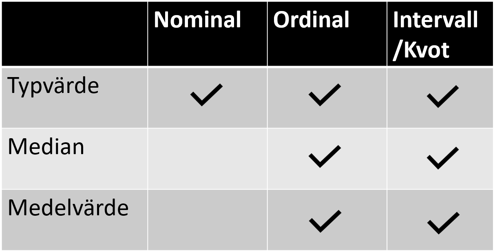
]

---

# Vilket centralmått spelar roll

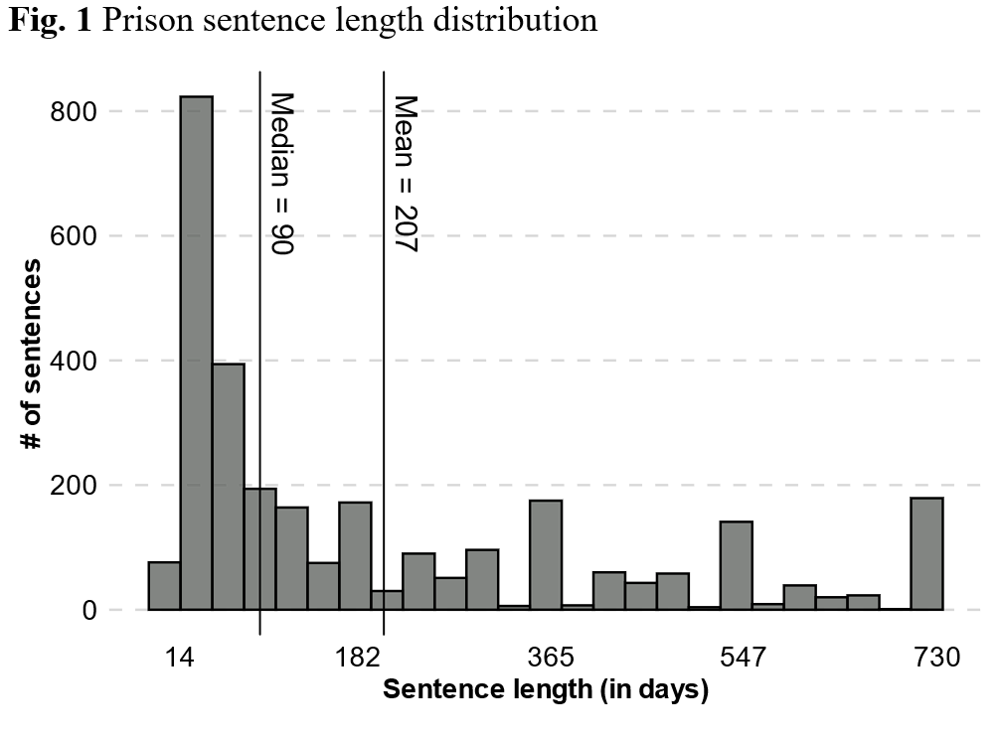

---

# Vilket centralmått spelar roll - Ungdomsbrottslighet?

.pull-left[
Åldersfördelning bland 25 intagna.

55	19	18	16	19
16	15	18	20	20
19	16	23	15	17
16	20	55	18	65
16	18	17	19	18
]

.pull-right[
Typvärde = 16

Median = 18

Medelvärde = 23
]

---

# Vilket centralmått spelar roll - Ungdomsbrottslighet?

.pull-left[
Åldersfördelning bland 25 intagna.

__55__	19	18	16	19
16	15	18	20	20
19	16	23	15	17
16	20	__55__	18	__65__
16	18	17	19	18
]

.pull-right[
Typvärde = 16

Median = 18

Medelvärde = 23
]
---

class: inverse, center, middle

# Grafisk resultatpresentation

---

# Stapeldiagram

.pull-left[
Används främst för kategoriska variabler
]

.pull.right[
```{r, echo=FALSE}

df_3 <- tibble(
  Brottstyp = sample(1:4, 1500, replace = TRUE, prob = c(0.1, 0.4, 0.2, 0.3))
)

df_3 <- df_3 %>% 
  mutate(Brottstyp = case_when(Brottstyp == 1 ~ "Misshandel",
                               Brottstyp == 2 ~ "Snatteri",
                               Brottstyp == 3 ~ "Inbrott",
                               Brottstyp == 4 ~ "Annat"))

data.frame(df_3 %>% 
             count(Brottstyp))
```

]
---

# Stapeldiagram

```{r, echo=FALSE,  out.width="60%", dpi = 150}
df_3 %>% 
  mutate(Brottstyp = forcats::fct_infreq(Brottstyp)) %>% 
  ggplot(aes(x = Brottstyp)) +
  geom_bar() +
  xlab("Brottstyp") +
  ylab("Antal") +
  theme(axis.text = element_text(size = 18),
        axis.title = element_text(size=20, face="bold"))

```

---

# Histogram

Används främst för __numeriska variabler__.

```{r, echo=FALSE, warning=FALSE, message = FALSE,  out.width="55%", dpi = 150}
df_3 <- tibble("Ålder" = rnorm(10000, 30, 5))

df_3 %>% 
  ggplot(aes(x = Ålder)) + 
  geom_histogram() +
  xlab("Ålder") +
  ylab("Antal") +
  theme(axis.text = element_text(size = 18),
        axis.title = element_text(size=20, face="bold"))
```

---

# Linjediagram

Används främst för __numeriska variabler__.

```{r, echo=FALSE,  out.width="55%", dpi = 150}
df_4 <- data.frame(year = c(2000, 2005, 2010, 2015, 2020),
                   sentences = c(9178, 10656, 9679, 8581 ,8964))

df_4 %>% 
  ggplot(aes(x = year, y = sentences)) + 
  geom_line(linewidth = 1.5) +
  geom_point(size = 5) +
  theme(axis.text = element_text(size = 18),
        axis.title = element_text(size=20, face="bold")) +
  scale_y_continuous(limits = c(0, 12000), breaks = seq(0, 12000, 2000)) +
  labs(x = "År",
       y = "Fängelseverkställigheter")

```

---

class: inverse, center, middle

# Sammanfattning

Kvantitativa forskningsprocessen - Från hypotes till resultatpresentation

Datanivåer och variabeltyper - Nominal, Ordinal, Intervall, Kvot

Univariat beskrivande statistik - Frekvenser och andelar samt centralmått

Grafisk resultatpresentation - Olika typer av figurer beroende på datanivå
